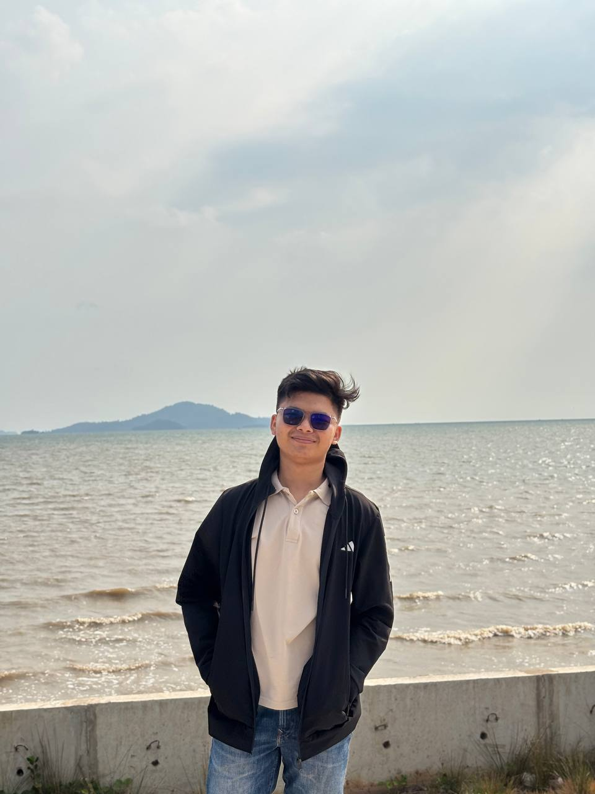
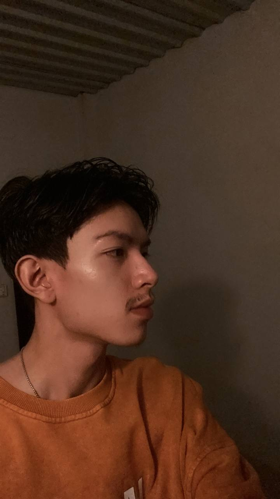

<!-- Intro Section -->
::: {.hero-section}
We are group 2 applying Linear Programming to solve real-world e-commerce challenges. This project was developed for the **Operations Research** course.
:::

 

<!-- Team Grid -->
::: {.grid}

<!-- MEMBER 1 -->
::: {.g-col-12 .g-col-md-4}
::: {.team-card}
{.team-img}

### Taing korngmeng

Quarto design,clean data

:::
:::

<!-- MEMBER 2 -->
::: {.g-col-12 .g-col-md-4}
::: {.team-card}
{.team-img}

### Phal Menghak

Mathematical Modeler

:::
:::

<!-- MEMBER 3 -->
::: {.g-col-12 .g-col-md-4}
::: {.team-card}
{.team-img}

### Sou Pichchomrong

Data Analyst 

:::
:::

:::